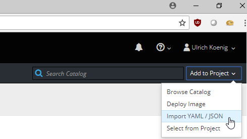

# Docker container images with "headless" VNC session

The repository contains a Docker images with headless VNC environments. It is a based on a clone from https://github.com/ConSol/docker-headless-vnc-container 

Several additional tools for DevOps and Development are added. To reduce complexity some options from the based repo like Centos OS and IceWM are deleted.   

Each Docker image is installed with the following components:

* Desktop environment [**Xfce4**](http://www.xfce.org)
* VNC-Server (default VNC port `5901`)
* [**noVNC**](https://github.com/novnc/noVNC) - HTML5 VNC client (default http port `6901`)
* Browser:
  * Mozilla Firefox
* Linux commands and tools:
  * vim wget curl net-tools locales zip git jq tree dnsutils inetutils-traceroute iputils-ping
* Optional Browsers:
  * Google Chrome
  * Chromium
* Optional Developer IDE:
  * Eclipse
  * IntelliJ
  * Netbeans
  * Visual Studio Code
* Optional Programing Languages:
  * Java
  * Python
  * NodeJS
* Additional optional tools:
  * Docker CLI and Kubernets helm
  * OpenShift CLI oc
  * Postman

     
  


## Usage in OpenShift / AppAgile

To build image in OpenShift / AppAgile you can use the dashboard or OpenShift oc client.
### Dashboard:

  * make a copy of [./openshift/openshift.base-template.yam](./openshift/openshift.base-template.yaml)
  
  * go to OpenShift / AppAgile -> Add to Project -> Import YAML / JSON
  
  
  * paste YAML into text field
  
  
  * add application name, vnc password, ...
  

  * add options; TRUE if you like to use in the image
  
  
  * save to internal catalog if you like
  
  
### OpenShift oc client:
  * TODO: add description

#### Objects in OpenShift / AppAgile
There are several OpenShift objects like "build", "deployment config", "service", etc.

Click on link "Routes - External Traffic" to get access via your desktop browser. Best experinces are wit Chrome or Firefox.


The default installation password is stored in a OpenShift secret. After installation you can change the default password in the secret. This will trigger a new deployment.


Or change password in the terminal of the pod. This password will be overwriten if the pod restartet. Type vncpasswd and add new password to times.


## Usage 
This chapter comes from the basic repo.
TODO: Review needed.
 
The usage is for all provide images **similar**, for instance see following the usage of the `consol/centos-xfce-vnc` image:

Print out help page:

    docker run consol/centos-xfce-vnc --help    

Run command with mapping to local port `5901` (vnc protocol) and `6901` (vnc web access):

    docker run -d -p 5901:5901 -p 6901:6901 consol/centos-xfce-vnc
  
Change the default user and group within a container to your own with adding `--user $(id -u):$(id -g)`:

    docker run -d -p 5901:5901 -p 6901:6901 --user $(id -u):$(id -g) consol/centos-xfce-vnc

If you want to get into the container use interactive mode `-it` and `bash`     

    docker run -it -p 5901:5901 -p 6901:6901 consol/centos-xfce-vnc bash

Build an image from scratch:

    docker build -t consol/centos-xfce-vnc centos-xfce-vnc

# Connect & Control
If the container is started like mentioned above, connect via one of these options:

* connect via __VNC viewer `localhost:5901`__, default password: `vncpassword`
* connect via __noVNC HTML5 full client__: [`http://localhost:6901/vnc.html`](http://localhost:6901/vnc.html), default password: `vncpassword` 
* connect via __noVNC HTML5 lite client__: [`http://localhost:6901/?password=vncpassword`](http://localhost:6901/?password=vncpassword) 


## Hints from cloned repository
TODO: Review and try out

### 1) Extend a Image with your own software
Since `1.1.0` all images run as non-root user per default, so that means, if you want to extend the image and install software, you have to switch in the `Dockerfile` back to the `root` user:

```bash
## Custom Dockerfile
FROM consol/centos-xfce-vnc
ENV REFRESHED_AT 2018-03-18

## Install a gedit
USER 0
RUN yum install -y gedit \
    && yum clean all
## switch back to default user
USER 1000
```

### 2) Change User of running Sakuli Container

Per default, since version `1.3.0` all container processes will executed with user id `1000`. You can change the user id like follow: 

#### 2.1) Using root (user id `0`)
Add the `--user` flag to your docker run command:

    docker run -it --user 0 -p 6911:6901 consol/centos-xfce-vnc

#### 2.2) Using user and group id of host system
Add the `--user` flag to your docker run command:

    docker run -it -p 6911:6901 --user $(id -u):$(id -g) consol/centos-xfce-vnc

### 3) Override VNC environment variables
The following VNC environment variables can be overwritten at the `docker run` phase to customize your desktop environment inside the container:
* `VNC_COL_DEPTH`, default: `24`
* `VNC_RESOLUTION`, default: `1280x1024`
* `VNC_PW`, default: `my-pw`

#### 3.1) Example: Override the VNC password
Simply overwrite the value of the environment variable `VNC_PW`. For example in
the docker run command:

    docker run -it -p 5901:5901 -p 6901:6901 -e VNC_PW=my-pw consol/centos-xfce-vnc

#### 3.2) Example: Override the VNC resolution
Simply overwrite the value of the environment variable `VNC_RESOLUTION`. For example in
the docker run command:

    docker run -it -p 5901:5901 -p 6901:6901 -e VNC_RESOLUTION=800x600 consol/centos-xfce-vnc
    
### 4) View only VNC
Since version `1.2.0` it's possible to prevent unwanted control over VNC. Therefore you can set the environment variable `VNC_VIEW_ONLY=true`. If set the docker startup script will create a random cryptic password for the control connection and use the value of `VNC_PW` for the view only connection over the VNC connection.

     docker run -it -p 5901:5901 -p 6901:6901 -e VNC_VIEW_ONLY=true consol/centos-xfce-vnc

### 5) Known Issues

#### 5.1) Chromium crashes with high VNC_RESOLUTION ([#53](https://github.com/ConSol/docker-headless-vnc-container/issues/53))
If you open some graphic/work intensive websites in the Docker container (especially with high resolutions e.g. `1920x1080`) it can happen that Chromium crashes without any specific reason. The problem there is the too small `/dev/shm` size in the container. Currently there is no other way, as define this size on startup via `--shm-size` option, see [#53 - Solution](https://github.com/ConSol/docker-headless-vnc-container/issues/53#issuecomment-347265977):

    docker run --shm-size=256m -it -p 6901:6901 -e VNC_RESOLUTION=1920x1080 consol/centos-xfce-vnc chromium-browser http://map.norsecorp.com/
  
Thx @raghavkarol for the hint! 

